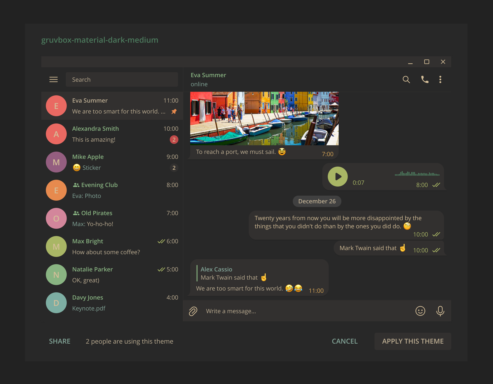

# Gruvbox Material Theme for Telegram Desktop

This repo contains a gruvbox material theme for telegram desktop.

This theme was forked from and builds upon [Bryan Gilbert](https://github.com/gilbertw1)'s work [Gruvbox Theme for Telegram Desktop](https://github.com/MasterGroosha/telegram-soliddark-theme) which derived from [Aleksandr](https://github.com/MasterGroosha)'s original work ["Solid Dark" theme](https://github.com/MasterGroosha/telegram-soliddark-theme)

The color palette was curated from [Sainnhe Park](https://github.com/sainnhe)'s [gruvbox-material](https://github.com/sainnhe/gruvbox-material) vim color theme, a modified version of [Gruvbox](https://github.com/morhetz/gruvbox).

## Preview



## Install

1. Create zip

	```
	$ make [THEME=<theme file>] [BACKGROUND=<background file>]
	```

	You can use the `THEME` variable to set the name of the resulted theme
	file and `BACKGROUND` to specify the background file.

	Correct values for `BACKGROUND`:

	* `tile.jpg`
	* `tile.png`
	* `background.jpg`
	* `background.png`

2. Send zip file to yourself (or someone else)

3. Click on file to install theme
